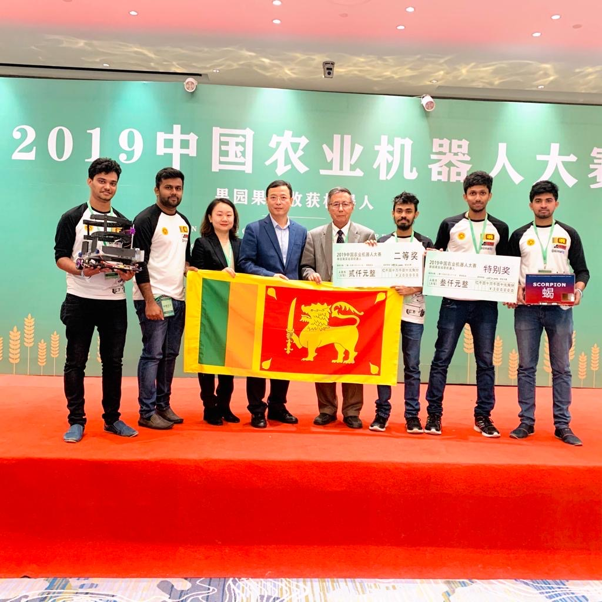

# China Agricultural Robot Competition

China Agricultural Robot Competition is an international competition which is organized by United Nations ESCAP organization together with China agricultural University in parallel to world’s biggest agricultural machinery exhibition.

#### Our team, Scorpion were the Second price in CARC 2019

